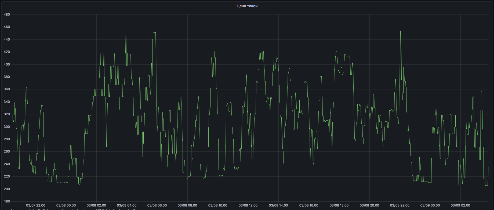
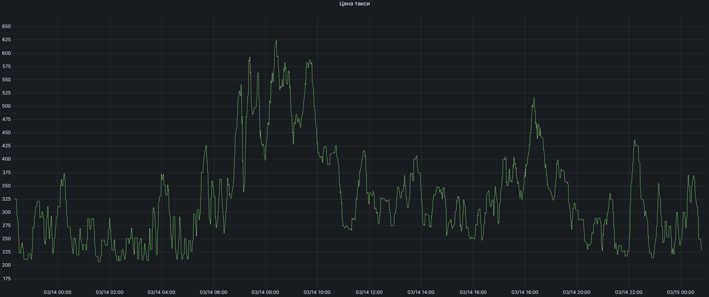

# Мониторинг стоимости поездок в Яндекс Такси

Каждый современный человек стремиться к комфорту и уюту. И как правило, способ передвижения из одного места в другое – это достаточно важное и частое действие. А одним из наиболее распространённых и востребованных решений современного рынка считается возможность воспользоваться услугами такси. Такой способ позволяет добраться до места назначения быстро и просто, без проблем и забот.

С другой стороны, так получается, что без мифов нормальное общество не живет, миф — это попытка привести тяжелый и противоречивый мир в состояние гармонии. И сфера вызова такси не стала исключением. 
Многие уверены: 
1. Стоимость на такси зависит от заряда батареи
2. Цена такси на Iphone больше, чем на Android
3. Повышенного спроса не существует

Рассмотрим правдоподобность этих пунктов. 

## Функциональность программы

Программа по заданным координатам (начала, конца) получает стоимость поездки, заносит данные в базу данных и отражает приемлемость стоимости поздки в System Tray.


## Ценность программы

По личному интересу мне захотелось поработать над простой бытовой задачей с некоторыми утоявшимися API из программ. Помимо этого, данная программа может быть полезна в качестве: 
1. Экономии денег. Мониторинг цен на такси помогает выбрать более дешевый вариант перевозки, сэкономить на транспортных расходах и избежать переплаты.2. Безопасность. Увеличение стоимости такси может свидетельствовать о росте спроса на услуги такси. Это может быть связано с повышенным спросом на транспорт в связи с конкретным событием или повышенной криминогенной обстановкой в городе. В таких случаях можно решить обратиться к другому виду транспорта, чтобы избежать возможных рисков.
3. Оперативность. Мониторинг цен на такси позволяет быть более гибким и оперативным при планировании поездок и выборе подходящей конкретному моменту услуги перевозки.
4. Удобство. Мониторинг цен на такси является отличным инструментом для планирования поездок, рассчета бюджета, избежания пробок и выбора подходящего по цене и качеству сервиса.
5. Изучение статистики. Данная программа будет хранить данные, которые после можно анализировать. 


## Немного о функциональности

Программа при запуске принимает входной параметр - путь до файла конфига. Конфиг программы содержит информацию о базе данных и о анализируемой поездке. Пример файла конфига приведен ниже.

````
# Application configuration file
    
hostName = "localhost";
portNum = 5432;
userName = "postgres";
password = "1234";
dbname = "taxi";

price1_Icon = "/usr/share/icons/Papirus/32x32/emotes/face-smile-big.svg";
price2_Icon = "/usr/share/icons/Papirus/32x32/emotes/face-worried.svg";

# Ниже параметры для описания поездки

start_longitude = "56.797128";
start_latitude = "60.580183";
end_longitude = "56.836332";
end_latitude= "60.605649";
class_auto = "business";
acceptable_cost = 230; 

````
Картинки для отображения в System Tray берутся из параметров price1_Icon (стоимость на данный момент ниже установленной в параметре acceptable_cost) и price2_Icon (стоимость поездки выше, чем acceptable_cost). Указанные из примера картинки взяты из пакета Papirus. 

Для его установки воспользуйтесь: 
````
sudo apt install papirus-icon-theme
````

Программа отправляет GET запрос по форме: 
````
https://taxi-routeinfo.taxi.yandex.net/taxi_info?clid=<clid>&apikey=<apikey>&rll=<lon,lat~lon,lat>&class=<class_str>&req=<req_str>
````
(Подробнее здесь: https://yandex.ru/dev/taxi/doc/dg/concepts/trip-info.html)

Для определения маршрута поездки используются координаты начала и конца поездки по данным конфига. Для опредения стоимости своей поездки задайте начальную и конечную долготу и широту. 

После получении ответа на запрос происходит парсинг тела ответа. Тело ответа содержит:
````
{
  "currency": "RUB",
  "distance": 61529.771101536542,
  "options": [
    {
      "class_level": 50,
      "class_name": "econom",
      "class_text": "Эконом",
      "min_price": 495,
      "price": 10945,
      "price_text": "10945 руб.",
      "waiting_time": 203.98798614740372
    }
  ],
  "time": 3816.9397069215775
}
````

После парсинга значения стоимости поездки оно сохраняется в Базу данных. 

В качестве  БД используется PostgreSQL. После, уже полученное значение стоимости сравнивается с приемлемым (acceptable_cost).

## Интеграция с БД

Для первичной настройки БД используйте скрипт:

````
CREATE DATABASE taxi;
CREATE table taxi_price(
  id serial primary key,
  curr_time timestamp,
  price real
);
````

Для получения записей БД используйте: 

````
SELECT * from taxi_price
````

## Полученные данные

Мною были сохранены стоимости такси в выходной день - *8 марта*:


и будний день *14 марта*: 


Горбы повышения стоимости одижаемые. В выходной день люди равномерно пользуются услугами такси, в то время как по будням есть очевидные пики - с 8 до 10 часов и с 17 до 20 (периоды пробок пути на РАБОТУ и с РАБОТЫ). Поездки из-за пробок становятся дольше, водители могут выполнить меньше заказов, из-за этого и повышается цена. 
